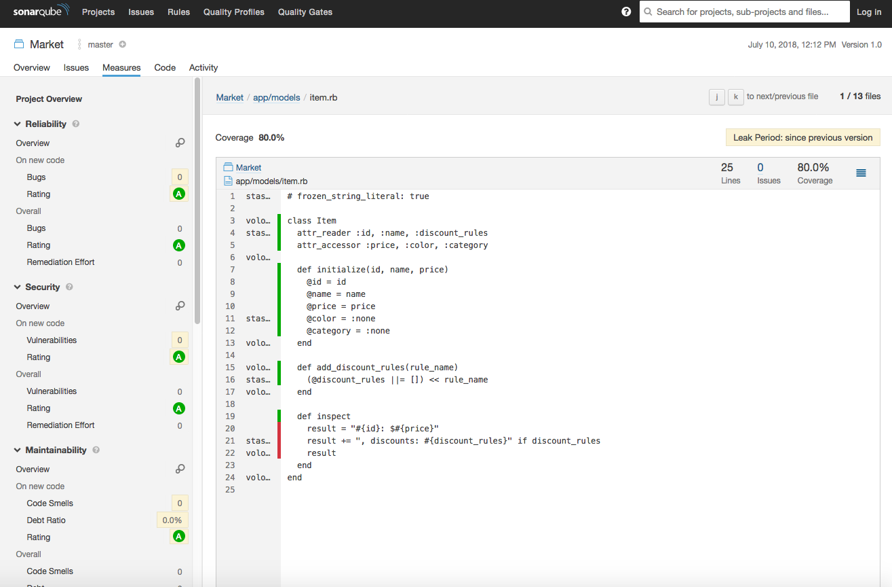
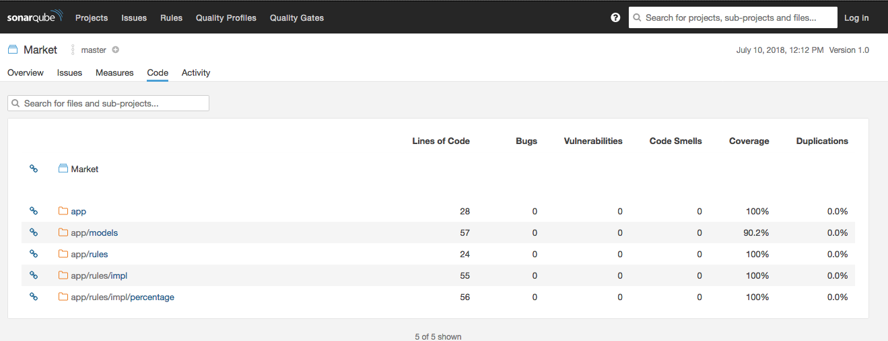
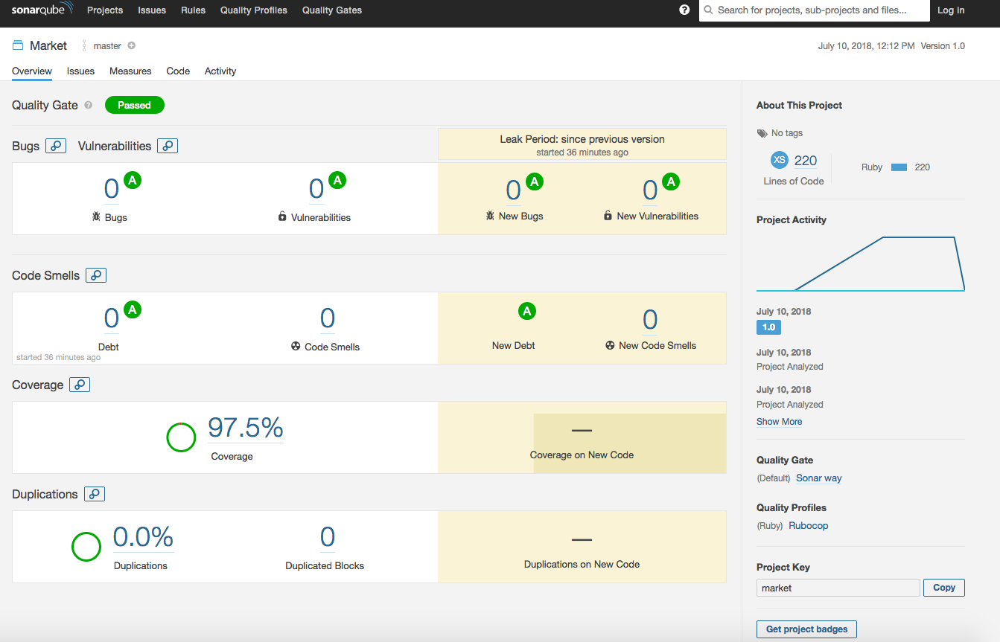

# Task
    При заказе товаров в интернет-магазине применяется скидка или несколько скидок. Алгоритмы скидок:
    
    1) При покупке товаров в категории "Еда" после 6ти вечера - 5%
    2) При покупке мыши и клавиатуры - 3%
    3) При покупке 10 товаров белого цвета - 1%
    
    Задачи:
    
    * Определить сущности
    * Определить таблицы базы данных и связи между ними
    * Определить классы, методы и аргументы методов. Обрисовать алгоритм оформления заказа с помощью этих методов.
    * Предусмотреть возможность добавления новых алгоритмов скидок (скидки не нужно динамически конфигурировать в базе данных)
    * Написать тесты для бизнес логики
    
    Run:
     * Result `ruby main.rb`
     * Tests `rspec`
     
 
# TODO
* Add "FactoryBot" gem
* Add more unit tests
* Ability to check rules if some already applied to products
* Split Rules on two classes with `can_apply?` and `modify_price!` in order to create more flexible rules
* Add order to rules

# SonarQube
    brew install sonarqube
## Download Ruby plugin from 
    Following all instruction here:
    https://github.com/fortitudetec/sonar-ruby-plugin
## Run sonar: 
    sonar console 
    #OR async
    brew services start sonarqube
## Add sonar-scanner to PATH
    #In my case:
    PATH=/Users/user/workspace/sonar-scanner-3.2.0.1227-macosx/bin:"$PATH"

    
    
 